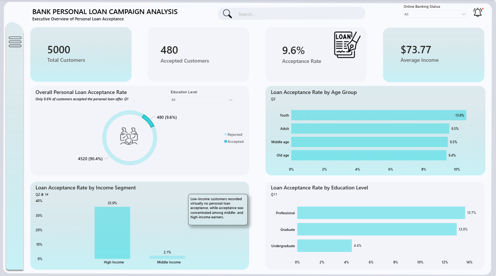
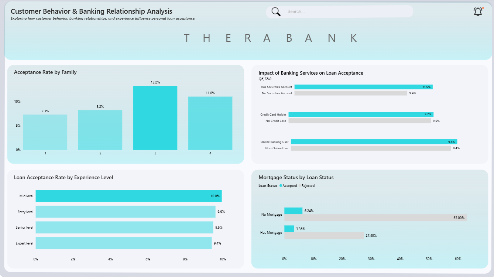
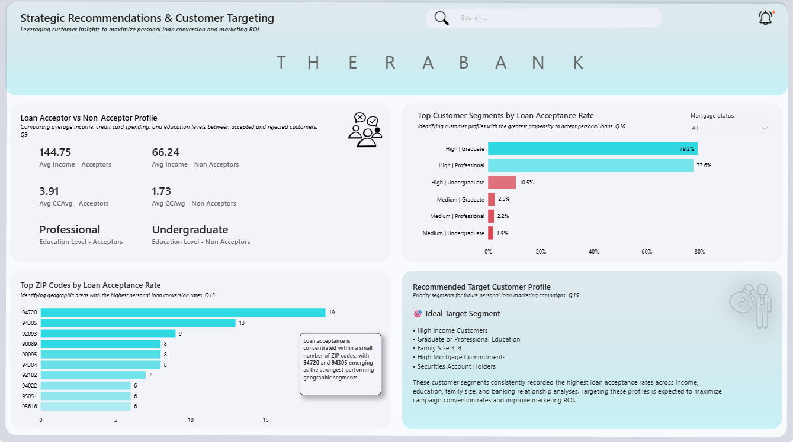

# THERA Bank — Personal Loan Campaign Analysis

A focused Power BI case study analyzing customer behavior and personal loan acceptance to identify high-potential customer segments and improve campaign targeting.

## Project Overview

THERA Bank's personal loan campaign generated a relatively low overall acceptance rate, creating an opportunity to understand which customer characteristics and banking relationships are associated with stronger conversion.

The analysis explores:

- Personal loan acceptance rates
- Income and education segments
- Age and family characteristics
- Banking service relationships
- Mortgage ownership
- Customer experience and behavioral patterns
- Geographic concentration of accepted customers
- High-potential customer segments for future campaigns

## Dashboard

### Executive Overview

### Customer Behavior & Banking Relationships

### Strategic Recommendations

## Key Findings

- Overall personal loan acceptance was **9.6%**.
- Higher-income customers showed substantially stronger acceptance than lower-income customers.
- Graduate and professional customers represented stronger-performing education segments.
- Customers with stronger banking relationships showed higher acceptance rates.
- High-income customers combined with graduate or professional education emerged as the strongest target segments.
- Acceptance was geographically concentrated within a relatively small number of ZIP codes.

## Strategic Recommendation

Focus future personal loan campaigns on high-income customers with graduate or professional education, stronger banking relationships, and favorable household characteristics.

## Tools

**Power BI · DAX · Data Analysis · Data Visualization**

## Project Type

Focused Power BI Case Study
